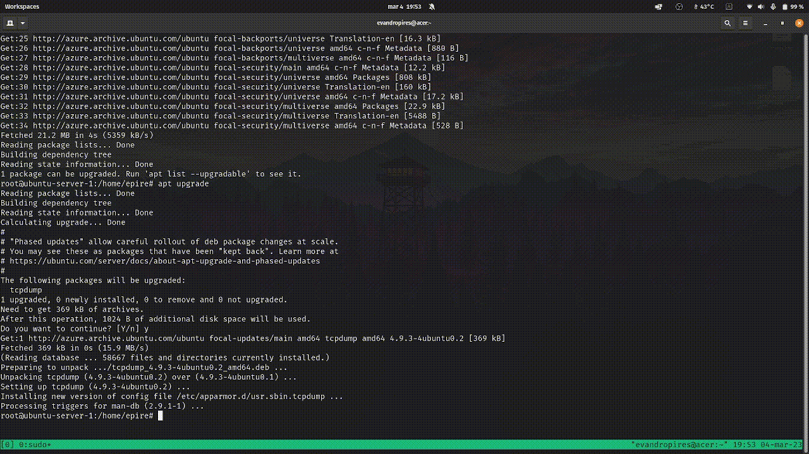

# Desafio projeto [DIO](https://www.dio.me/) utilizando Docker: implementando uma estrutura de Microsserviços :whale:

## Replicando na prática a tecnologia de containers ministrado pelo instrutor Denilson Bonatti, dentro do Bootcamp Linux do zero :penguin:

  

#### Iniciando a VM via SSH :

`ssh -i <chave ssh> <username>@<ip_público>`
___

#### Instalando docker:

`curl -fsSL [https://get.docker.com](https://get.docker.com/) -o get-docker.sh](http://get-docker.sh/)` > download do docker.

`sudo sh [get-docker.sh](http://get-docker.sh/)` > iniciando instalação.

`systemctl status doker` > verificando se docker realmente está ativo.
___

#### Criando volumes:

A principal função do volume é persistir os dados. Diferentemente do filesystem do container, que é volátil e toda informação escrita nele é perdida quando o container morre, quando você escreve em um volume aquele dado continua lá, independentemente do estado do container. 

`docker volume create app`

`docker volume create data`

`docker run -e MYSQL_ROOT_PASSWORD=Senha123 -e MYSQL_DATABASE=meubanco --name mysql-A -d -p 3306:3306 --mount type=volume,src=data,dst=/var/lib/mysql/ mysql:5.7` > criar e executar novo contêiner Docker com base em uma imagem especificada mysql:5.7

  
Detalhando o comando

|Partes do comando | o que faz                                                                        |
|--------|----------------------------------------------------------------------------------|
|`-e MYSQL_ROOT_PASSWORD=Senha123`| define a senha de root do MySQL para "Senha123" como uma variável de ambiente dentro do contêiner |
|`-e MYSQL_DATABASE=meubanco`     | cria um banco de dados chamado "meubanco" como uma variável de ambiente dentro do contêiner      |
|`--name mysql-A`                 | define o nome do contêiner como "mysql-A"
|`-d`                             | executa o contêiner em segundo plano (modo "detached")
|`-p 3306:3306`                   | mapeia a porta 3306 do contêiner para a porta 3306 do host, permitindo que aplicativos externos se comuniquem com o MySQL dentro do contêiner|
|`--mount type=volume,src=data,dst=/var/lib/mysql/`| cria um volume chamado "data" e o monta no diretório "/var/lib/mysql/" dentro do contêiner, permitindo que os dados do banco de dados sejam armazenados persistentemente fora do contêiner |
|`mysql:5.7`| especifica a imagem do Docker usada para criar o contêiner, nesse caso, a imagem do MySQL versão 5.7.

`docker ps`
___

####

